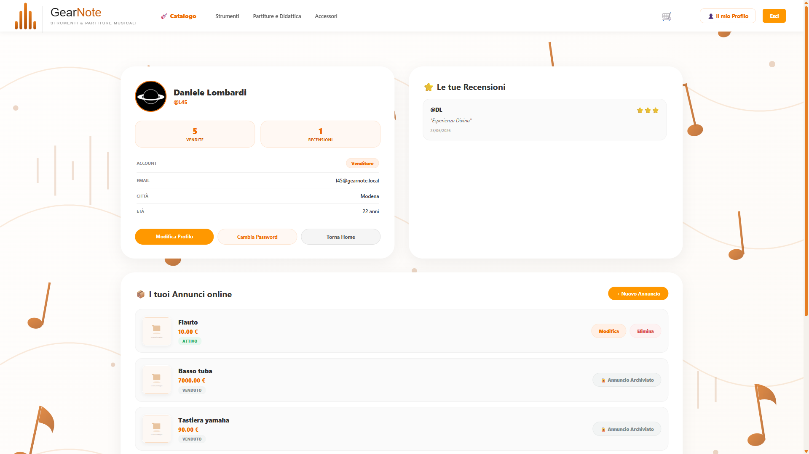
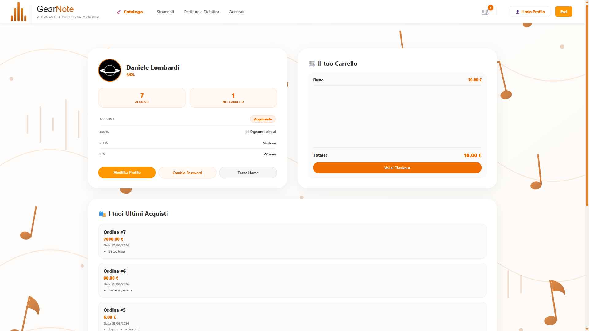
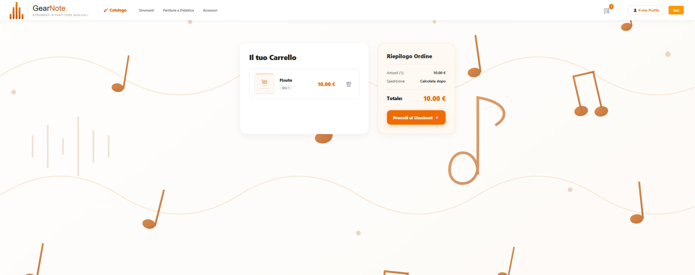
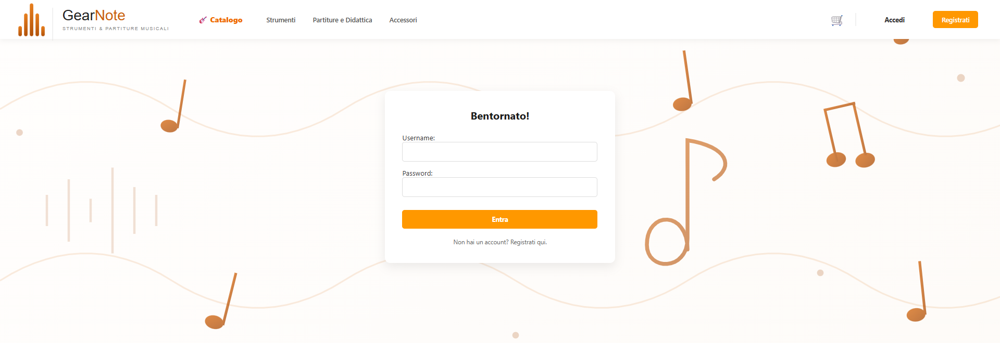
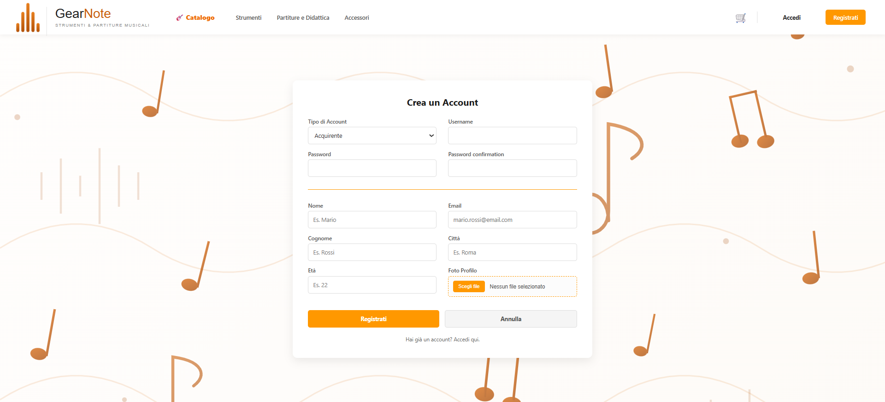

<div align="center">

# 🎵 GearNote 🎵
**Marketplace per la compravendita di strumenti musicali tra privati**

</div>

<div align="justify">
    GearNote è una piattaforma e-commerce verticale dedicata alla compravendita di strumenti musicali e spartiti tra privati. Il sistema gestisce l'intero ciclo di vita di un annuncio: dalla pubblicazione da parte del venditore, alla navigazione e all'acquisto sicuro da parte dell'acquirente.

---
## 📦 Installazione

### Prerequisiti

- `Python 3.12+`
- `pipenv`

### Procedura

```bash
# 1. Clona il repository
git clone https://github.com/Lombardi2003/GearNote.git
cd GearNote

# 2. Crea l'ambiente virtuale e installa le dipendenze
pipenv install
pipenv shell

# 3. Entra nella directory Django
cd GearNote

# 4. Applica le migrazioni
#    (crea automaticamente i gruppi Acquirente/Venditore e un superuser 'admin')
python manage.py migrate

# 5. Avvia il server
python manage.py runserver
```

Il server sarà raggiungibile su **http://127.0.0.1:8000**

> [!NOTE] 
> Il comando `migrate` esegue uno script di inizializzazione che crea i gruppi `Acquirente` e `Venditore` e un superuser `admin` di default.

---

## 🏗 Architettura

Il progetto segue il pattern **MVT (Model-View-Template)** di Django, organizzato in tre app modulari indipendenti:

| App | Responsabilità |
|:---|:---|
| `accounts` | Autenticazione, registrazione, profili utente e gestione ruoli |
| `catalog` | Pubblicazione, modifica ed eliminazione degli annunci |
| `cart` | Carrello, aggiunta prodotti e logica dei pezzi unici |

La logica di sicurezza — controllo ruoli e verifica della proprietà degli oggetti — è implementata direttamente nelle view Django, senza dipendenze da librerie esterne di autorizzazione. Questo rende ogni flusso di accesso esplicito e ispezionabile.

---


## ⚙️ Funzionalità principali

### Gestione ruoli

Il sistema distingue in modo netto due tipologie di utente, assegnate in fase di registrazione e verificate su ogni richiesta:

| Ruolo | Può fare |
|:---|:---|
| `Acquirente` | Navigare il catalogo, aggiungere al carrello, acquistare |
| `Venditore` | Creare, modificare ed eliminare i propri annunci |

Nessun ruolo può accedere alle funzionalità dell'altro, nemmeno manipolando direttamente gli URL.

### Catalogo prodotti

- Creazione annunci con titolo, descrizione, prezzo, condizione e disponibilità
- Modifica ed eliminazione riservate al venditore proprietario dell'annuncio
- Filtraggio e ricerca per categoria, condizione e fascia di prezzo

### Carrello

- Controllo real-time della disponibilità: prodotti con `disponibile=False` non possono essere aggiunti
- Gestione pezzi unici: la quantità di un articolo usato non può mai superare `1`
- Riepilogo ordine con calcolo del totale

---

## 🧪 Testing

Il progetto include una suite di test unitari focalizzata sui **casi limite e i vettori di attacco**, non sui percorsi nominali già garantiti dal framework.

### Esecuzione

```bash
# Tutte le app
python manage.py test

# Per singola app
python manage.py test accounts
python manage.py test catalog
python manage.py test cart
```

---

## 📁 Struttura del progetto

```
GearNote/
├── ⚙️ GearNote/                    # Configurazione Django
├────├─ 👤 accounts/                # Autenticazione e profili
├────├─ 📦 catalog/                 # Annunci e prodotti
├────├─ 🛒 cart/                    # Carrello acquisti
├── 🖼️ img/                         # Screenshot dell'interfaccia
├── 🐍 Pipfile
├── 🔒 Pipfile.lock
└── 📝 README.md
```

---

## 📸 Screenshot

<div align="center">

### Homepage


### Dashboard Venditore




### Dashboard Acquirente



### Carrello



### Login



### Registrazione



</div>